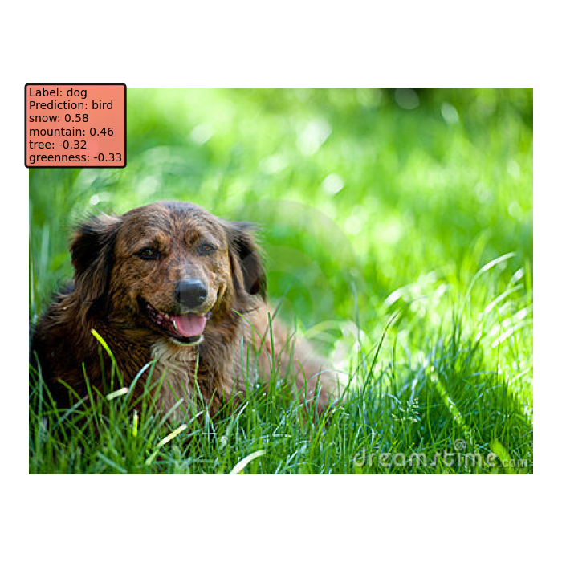

# Meaningfully debugging model mistakes with conceptual counterfactual explanations

# What is this work about?


Understanding model mistakes is critical to many machine learning objectives yet this is still an ad hoc process that involves manually looking at the model’s mistakes on many test samples and guessing the underlying reasons for those incorrect predictions. With CCE, we would like to take a step towards systematically analyzing model mistakes using high-level human understandable terms, i.e. concepts!

Here is an overview of our framework, and you can find more in our ICML 2022 paper [Meaningfully Debugging Model Mistakes using Conceptual Counterfactual Explanations](https://arxiv.org/abs/2106.12723).


This is joint work with the wonderful [Abubakar Abid](https://twitter.com/abidlabs) and [James Zou](https://www.james-zou.com/).


Here we aim to make the code as easy to use as possible, so that you could go ahead and try conceptual counterfactual explanations without too much overhead!


# How to generate conceptual counterfactuals?


## Learning a concept bank
First, you need to define a concept bank for your problem. In our experiments, we derive the Broden Concept Bank which consists of 170 concepts. <br>

In `banks/resnet18_bank.pkl` we release the concept bank and concept statistics for a ResNet18. If you wish to train your own concept banks, you can use the script `learn_concepts.py`. 

`````
python learn_concepts.py --concept-data=/user/concept-folder/ --model-name resnet18 --C=0.001 --output-folder=banks/
`````
For details, please refer to the `learn_concepts.py` script and/or our paper.

## Generate counterfactual explanations
Given a concept bank and a model, you can run `generate_counterfactuals.py` to generate the explanations. For instance, the command <br>
`````
python3 generate_counterfactuals.py --concept-bank=examples/resnet18_bank.pkl --image-folder=examples/images/ --model-path="./examples/models/dog(snow).pth"
`````
runs the script to generate counterfactual explanations for the images in the `sample_images` folder for the ResNet18 model. The output should be saved to `examples/{image_name}_explanation.png` file for each image. For the examples that we share, upon running the command above, the output image should look like the following: <br>

 <br>
We took the example image from the [LAION5B](https://laion.ai/blog/laion-5b/) dataset (you should check it out, it's v cool).

# Metashift Experiments:
First, please obtain the Metashift using instructions in the [Metashift Repository](https://metashift.readthedocs.io). 

## A few things to do to run Metashift experiments:
Please go to `/metashift/constants.py` to replace the pointers to the dataset. Particularly, the `METASHIFT_ROOT` variable should be replaced with to the dataset, with `METASHIFT_ROOT/allImages/images/` and `METASHIFT_ROOT/full-candidate-subsets.pkl/`.

## How do we train spuriously correlated models?
There are a few simple commands in `/metashift/run_experiments.sh`. For instance,
```
python3 train.py --dataset="bear-bird-cat-dog-elephant:dog(snow)"

``` 
will run the 5-class classification model, where during training, all of the dog images are sampled from the snow domain. 

## Do I have to train models from scratch?
For convenience, we also share checkpoints for some of the model we trained. You can find them in `/examples/`.
For instance, `/examples/models/dog(snow).pth` is the model for the `dog(snow)` scenario.

## How do we evaluate CCE?
Similarly, see `/metashift/run_experiments.sh`. You can either specify the model with `--model-path`, or use the same output directory where you have the confounded model. For instance, you can use 
```
python3 evaluate_cce.py --dataset="bear-bird-cat-dog-elephant:dog(snow)" --concept-bank="../examples/resnet18_bank.pkl" --model-path="../examples/dog(snow).pth"
```
to evaluate the model that we provide with this repository. Or, if you have trained your own models, you can use
```
python3 evaluate_cce.py --dataset="bear-bird-cat-dog-elephant:dog(snow)" --concept-bank=/your/bank/path/ --out-dir=/your/output/directory/
```
to evaluate your model.

# Contact
If you have any concerns or questions, please reach out to me at `merty@stanford.edu`. 

If you find this work useful, please consider citing our ICML 2022 paper:

    @InProceedings{abid22a,
      title = 	 {Meaningfully debugging model mistakes using conceptual counterfactual explanations},
      author =       {Abid, Abubakar and Yuksekgonul, Mert and  Zou, James},
      booktitle = 	 {Proceedings of the 39th International Conference on Machine Learning},
      year = 	 {2022},
      volume = 	 {162},
      series = 	 {Proceedings of Machine Learning Research},
      publisher =    {PMLR},
      url = 	 {https://proceedings.mlr.press/v162/abid22a.html}
    }
